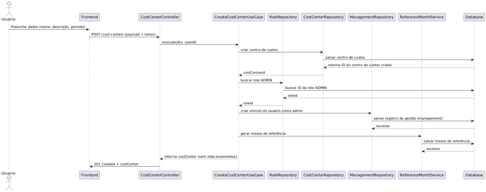

# CREATE COST CENTER SEQUENCE DIAGRAM



```
@startuml
actor Usuario as User
participant "Frontend" as FE
participant "CostCenterController" as Controller
participant "CreateCostCenterUseCase" as UseCase
participant "RoleRepository" as RoleRepo
participant "CostCenterRepository" as CostRepo
participant "ManagementRepository" as MgmtRepo
participant "ReferenceMonthService" as RefMonthService
participant "Database" as DB

User -> FE: Preenche dados (nome, descrição, período)
FE -> Controller: POST /cost-centers (payload + token)
Controller -> UseCase: execute(dto, userId)

UseCase -> CostRepo: criar centro de custos
CostRepo -> DB: salvar centro de custos
DB --> CostRepo: retorna ID do centro de custos criado
CostRepo --> UseCase: costCenterId

UseCase -> RoleRepo: buscar role ADMIN
RoleRepo -> DB: buscar ID da role ADMIN
DB --> RoleRepo: roleId
RoleRepo --> UseCase: roleId

UseCase -> MgmtRepo: criar vínculo do usuário como admin
MgmtRepo -> DB: salvar registro de gestão (management)
DB --> MgmtRepo: sucesso

UseCase -> RefMonthService: gerar meses de referência
RefMonthService -> DB: salvar meses de referência
DB --> RefMonthService: sucesso

UseCase --> Controller: retorna costCenter (sem relacionamentos)
Controller -> FE: 201 Created + costCenter
@enduml

```
